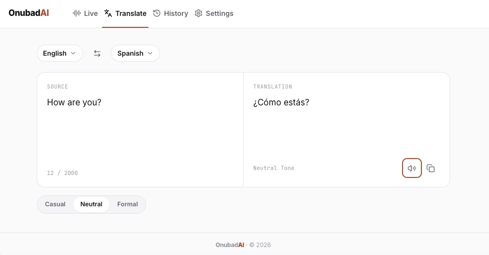

# Onubad AI

Real-time AI-powered translation app built with Next.js and OpenAI.



## Features

- Text translation with history
- Live voice translation with OpenAI Realtime API
- Text-to-speech output with configurable voice settings

## Stack

- Next.js 14, TypeScript, Tailwind CSS
- OpenAI API (GPT, Realtime, TTS)

## Getting Started

```bash
cp .env.example .env.local
npm install
npm run dev
```

Open [http://localhost:3000](http://localhost:3000).

## Environment Variables

See `.env.example` for required keys.

## License

MIT
